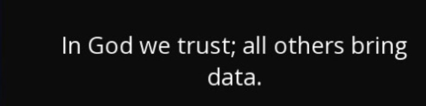

# Welcome to my data science portfolio

  

- My name is Pedro Almeida. I am from Brazil and I am 20 years old. Currently, I am a B.Sc. student majoring in Computer Engineering at the Federal University of Brasília. I am passionate about machine learning, data science, and math. I have been working on projects in this area, constantly studying and striving to enhance my knowledge and skills. Check them out below!
- Contact me:
  - E-mail: pedrooalmeida.net@gmail.com
  - LinkedIn: https://www.linkedin.com/in/pedro-henrique-almeida-oliveira-77b44b237/

## PROJECTS

## CLASSIFICATION

###[****GERMAN BANK'S CREDIT SCORING****](https://github.com/allmeidaapedro/Credit-Scoring-German-Bank)

- This is an end-to-end machine learning project (from data collection to deploy) that uses Random Forest to assign credit scores to potential customers of a German bank.
- By doing so, it can make informed decisions, protecting Return on Investment (ROI) while minimizing credit risk.
- I estimated financial results calculating ROI using the expected revenue from non-defaulters' loans, the expected loss from defaulters' loans, and the total credit amount lent before the solution and after changing the bank's credit policy from my credit scoring model. Finally, after extending credit only to customers with a credit score of 600 or higher, the ROI increased from 9.55% to 42.64%.
- [Check out the entire project] (https://github.com/allmeidaapedro/Credit-Scoring-German-Bank)

- - Some results obtained and model validation;

  

