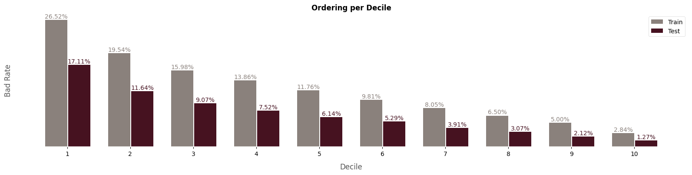
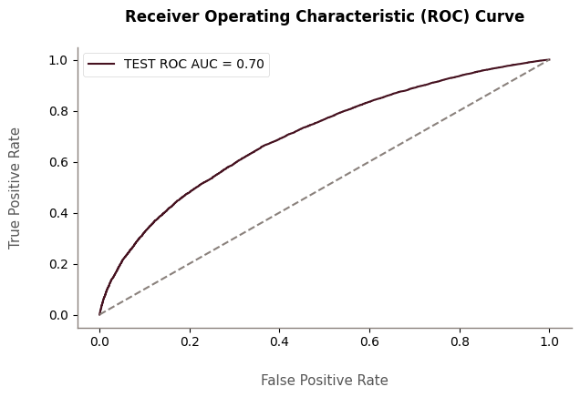

# Data-Science-Portfolio

# Welcome to my data science portfolio!

  

Hello! My name is Pedro Almeida and I am a 22-year-old student pursuing a Bachelor's degree in Computer Engineering at the University of Brasília. Currently, I work as a Data Scientist at Banco do Brasil. My passion lies in machine learning, data science, statistics, and mathematics, and I am constantly working on projects in these areas. Explore them below!

## Projects

## CLASSIFICATION AND REGRESSION

### [**Credit Risk Modeling (PD, EAD, LGD, EL) - Lending Club**](https://github.com/allmeidaapedro/Lending-Club-Credit-Scoring)
- **Description:** In this project, I perform credit risk modeling, including Probability of Default (PD), Exposure at Default (EAD), Loss Given Default (LGD), and Expected Loss (EL) models, using data from loans from 2007 to 2014 from the American institution Lending Club.
- **Business problem:** Lending Club faces a significant challenge in managing loss risks while optimizing profit for its investors. The platform aims to estimate risks accurately to maintain a sustainable and profitable business. Therefore, the CEO wants insights into credit risk in the company's lending operations and models of PD, EAD, and LGD to estimate expected loss (EL) on each loan. This, along with credit scores, will be used to develop possible credit policies in the company. Furthermore, being an online platform, it is important to explain to customers why a loan is approved or denied. So, the results of these models must be explainable and interpretable.
- **Objectives:** Develop PD, EAD, and LGD models to compute expected loss on each loan, EL. From this, develop a credit policy considering the estimated losses and the annualized ROI of each asset. Then, monitor the model, accessing population stability indicators, gauging the need for a new model one year after it is built.
- **Results:** The PD model achieved good discriminatory capacity, with AUC = 0.7 and KS = 0.3, as well as ordering in scores, concentrating more than 50% of bad customers up to the third score range. The LGD and EAD models obtained satisfactory predictive power. The credit policy was developed and reduced both expected losses and default rates. The model was monitored, and the need to develop it again soon was assessed, as the scores showed a PSI of 0.19.
- [Click here to check the complete project](https://github.com/allmeidaapedro/Lending-Club-Credit-Scoring)

- Some obtained results and model validation;

  

  

### [**Credit Card Churn Prediction**](https://github.com/allmeidaapedro/Churn-Prediction-Credit-Card)
- **Description:** This is an end-to-end machine learning project (from data collection to deployment) that uses LightGBM to predict the probability of a customer canceling a bank's credit card service.
- **Business problem:** The bank manager is tired of seeing more and more customers stop using their credit card product. He needs us to identify the probability of canceling the service for each customer, in order to rank them by cancellation chance and take possible actions from it, such as offering promotions. Identifying potential churners helps plan retention strategies, maintaining healthy revenue. Acquiring a new customer is more expensive than retaining an existing one.
- **Objectives:** Identify factors associated with customer churn; build a model capable of accurately predicting the probability of canceling the service for a customer; offer action plans for the bank to reduce credit card churn.
- **Results:** It was possible to obtain an estimated gain of $171,477, by calculating the difference between the gain from true positives, the cost of retaining false positives, and the cost of false negatives canceling. Additionally, the model demonstrates incredible performance due to the quality of the data and the modeling carried out.
- [Click here to check the complete project](https://github.com/allmeidaapedro/Churn-Prediction-Credit-Card)

- Some analyses conducted;

  

  

- Deployment;

  

## REGRESSION AND TIME SERIES

### [**Store Item Demand Forecasting**](https://github.com/allmeidaapedro/Store-Item-Demand-Forecasting)
- **Description:** In this project, I performed time series forecasting using LightGBM to predict the number of sales of 50 items in 10 different stores over a period of 3 months.
- **Business problem:** A retail store manager wants to plan a strategy to manage inventory and investments in 10 stores for 50 products, aiming to effectively meet customer demand. By employing predictive analytics, they seek to improve sales forecasts, maintain product availability, and boost overall store performance.
- **Objectives:** Identify business insights about sales over time, such as seasonal patterns and trends; build a model capable of accurately predicting sales for the next 3 months; Estimate financial results considering these forecasts.
- **Results:** The financial result per store, per store and item, and for the total company is present in the project. The company expects to sell a total of 2,559,998 items in the next 3 months, with an average of about 27,527 items per day. Considering the average error, this number may vary by about 404 items daily. Therefore, on bad days, it is expected to sell 27,123 items and, on good days, 27,931 items. In total, over the 3 months, it is expected to sell, in the worst-case scenario, 2,522,455 and, in the best-case scenario, 2,597,542 items.
- [Click here to check the complete project](https://github.com/allmeidaapedro/Store-Item-Demand-Forecasting)

- Some analyses conducted;

  

- Model results;

  

## CLUSTERING

### [**Customer Segmentation and Loyalty Program for Retail Store**](https://github.com/allmeidaapedro/Customer-Segmentation-Retail)
- **Description:** In this project, I performed an unsupervised learning clustering task using K-Means to segment and profile customers of a retail store, developing a loyalty program.
- **Business problem:** A retail store wants to understand more deeply the characteristics of its customers and strategically use this information to maximize sales and revenue. For this, they want to segment them into profiles, according to preferences, spending patterns, and behavior. Armed with this, they want to increase connection with consumers, developing a loyalty program, offering benefits to the best groups and trying to convert other groups to the same behavior pattern.
- **Objectives:** Identify customer groups, profiling them, creating personas, and develop a loyalty program based on an ideal customer profile to increase retention and revenue.
- **Results:** After segmenting customers, a loyalty program called "Prosperous" was developed based on the profile of our best customers, the Prosperous. The loyalty program has the potential to increase the store's total revenue by 9%, totaling $125,228.55. Therefore, the project is valid.
- [Click here to check the complete project](https://github.com/allmeidaapedro/Customer-Segmentation-Retail)

- Clustering;

  

- Model results;

  

## EXPLORATORY DATA ANALYSIS, CLASSIFICATION, AND REGRESSION

### [**Analysis and modeling of enem 2022 microdata**](https://github.com/allmeidaapedro/Enem-Modeling)

- **Description:** This is an end-to-end data science project (from data collection to deployment), in which data cleaning, exploratory analysis, and modeling of ENEM 2022 microdata (real public data) are performed.
- **Problem and objectives:** The objective is to perform an analysis and modeling of performance and abstention in the exam. The performance analysis and modeling aim to identify the relationship of variables with the student's grade and build a model for predicting this grade and understanding the impact of variables on it. The abstention analysis and modeling aim to identify the relationship of variables with student abstention and build a model to predict the probability of a student abstaining from the exam, as well as interpret its results, in the same way. LightGBM algorithm was used for this, given its predictive power, fast training, and prediction.
- **Results:** Interesting relationships were noticed through exploratory data analysis and SHAP values analysis, such as, the higher the candidate's mother's education level, the higher the performance and the lower the abstention rate. The models had satisfactory performances. With MAE = 55.7, on average, the model's predictions deviate from the students' actual grades by 55.7 points. With ROC-AUC = 0.69, there is discriminatory power in distinguishing students who were present and students who were absent. Two Flask APIs were developed for deployment of the models of both aforementioned analyses. Thus, it is possible to predict a candidate's grade or the probability of abstention by providing socioeconomic and educational data about them.
- [Click here to check the complete project](https://github.com/allmeidaapedro/Enem-Modeling)
- Some insights:
  
   

  
  

  
    

    
    

      
- Some obtained results and model validation;
  

  

- Deployment;

  

  

## DATA ANALYSIS, SQL, AND POWER BI

### [**Olist Data Analysis (e-commerce, in development)**](https://github.com/allmeidaapedro/Olist-Data-Analysis)

- **Description:** This is a data analysis project using SQL and PowerBI in which data cleaning, exploratory data analysis, and dashboard construction based on Olist data (Brazilian e-commerce) are performed.
- **Problem and objectives:** The objective is to analyze customer, order, product, seller, and sales data from Olist from 2016 to 2018 to answer relevant business questions previously established in order to generate value to the business.
- **Results:** Among some interesting insights obtained in SQL analysis are:
  - Sales show a growth trend over the two years, with a peak in November 2017, probably due to Black Friday.
  - There is a negative correlation between evaluation score and delivery time of orders. This means that orders with longer delivery times tend to result in poor evaluations from customers.
  - The vast majority of customers, sellers, and orders are concentrated in the state of São Paulo.
- [Click here to check the complete project](https://github.com/allmeidaapedro/Olist-Data-Analysis)

## UNDER DEVELOPMENT
- Currently, I am delving into credit modeling and MLOPS.

## CONTACT
* [LinkedIn](https://www.linkedin.com/in/pedro-almeida-ds/)
* [GitHub](https://github.com/allmeidaapedro)
* [Email](pedrooalmeida.net@gmail.com)
