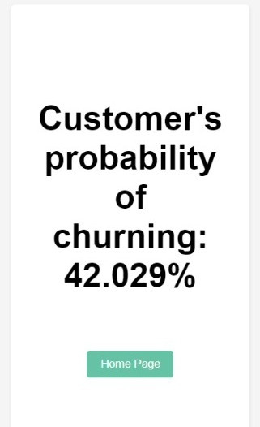

# Welcome to my data science portfolio!

  

I'm Pedro Almeida from Brazil, a 20-year-old B.Sc. student majoring in Computer Engineering at the Federal University of Brasília. Currently, I'm working as a quantitative analyst intern at Disrux and Arthur Mining. In this role, I conduct quantitative analysis in various financial market areas, including crypto, blockchain, and investment. I apply data analysis, visualization, and storytelling using Python and statistical methods. Additionally, I actively contribute to my team by developing tools, solutions, and machine learning models to enhance market analysis. My enthusiasm lies in machine learning, data science, and mathematics, and I'm constantly working on projects in these areas. Explore them below!

## PROJECTS
 
 
## EXPLORATORY DATA ANALYSIS, CLASSIFICATION AND REGRESSION

### [**Enem analysis and modelling**](https://github.com/allmeidaapedro/Enem-Analysis)
- This is an end-to-end data science project (from data collection to deployment) where data cleaning, exploratory data analysis, and modeling are performed on microdata from the ENEM 2022 (real public data). ENEM (Exame Nacional do Ensino Médio) is a standardized national exam in Brazil used for university admissions and evaluation of high school education.
- Cleaning was crucial, given that the original microdata set was over 2 GB in size, making data manipulation, analysis, and modeling impractical. After completion, a parquet file was obtained, reducing the size of the original dataset from over 2 GB to approximately 221.7 MB, nearly 10%.
- The analysis and modeling are divided into two approaches:
  - Performance analysis and modeling: The goal of this analysis is to identify the key variables impacting the candidate's score, understand their relationship with performance, and utilize them for predicting the score. For the prediction task, a Lasso Regression model is employed, due to interpretability (coefficients), regularization and feature selection characteristics.
  - Absenteeism analysis and modeling: The objective of this analysis is to identify the primary factors influencing a candidate's absence from the exam. Additionally, it aims to examine how these factors correlate with absenteeism and predict the probability of a student's abstention. For the prediction task, a Logistic Regression model is utilized, due to interpretability (exponential coefficients), regularization through l1 penalty, class_weight hyperparameter and efficiency characteristics.
- Two Flask APIs were developed for deploying the models from both aforementioned analyses. This enables the prediction of a candidate's score or the probability of absenteeism by providing socioeconomic and educational data about the candidate.

- Some results obtained and model validation;

  

  

- Deployment;

  

## CLASSIFICATION

### [**German Bank's Credit Scoring**](https://github.com/allmeidaapedro/Credit-Scoring-German-Bank)
- This is an end-to-end machine learning project (from data collection to deploy) that uses Random Forest to assign credit scores to potential customers of a German bank.
- By doing so, it can make informed decisions, protecting Return on Investment (ROI) while minimizing credit risk.
- I estimated financial results calculating ROI using the expected revenue from non-defaulters' loans, the expected loss from defaulters' loans, and the total credit amount lent before the solution and after changing the bank's credit policy from my credit scoring model. Finally, after extending credit only to customers with a credit score of 600 or higher, the ROI increased from 9.55% to 42.64%.
- [Click here to check out the entire project](https://github.com/allmeidaapedro/Credit-Scoring-German-Bank)

- Some results obtained and model validation;

  

- Deployment;

  

### [**Credit Card Churn Prediction**](https://github.com/allmeidaapedro/Churn-Prediction-Credit-Card)
- This is an end-to-end machine learning project (from data collection to deploy) that utilizes XGBoost to predict customer's probability of churning in a bank's credit card service.
- Identifying likely churners helps plan strategies for retention, maintaining healthy revenue. Acquiring a new customer is costlier than keeping one. 
-  The main objectives were: Identify the factors associated with customer churn; construct a model capable of predicting as many potential churners as possible; offer action plans for the bank to reduce credit card customer churn.
- It was possible to achieve an estimated gain of $198,098.82 by calculating the difference between the true positive gain, the cost of retaining false positives and the cost of false negatives churning.
- [Click here to check out the entire project](https://github.com/allmeidaapedro/Churn-Prediction-Credit-Card)

- Some analysis made;

  

 
- Deployment;

  

## REGRESSION / TIME SERIES FORECASTING

### [**Store Item Demand Forecasting**](https://github.com/allmeidaapedro/Store-Item-Demand-Forecasting)
- In this project, I performed time series forecasting using LightGBM to predict sales for 50 items across 10 different stores in a 3-month period.
- By doing this, the company will be able to strategically manage inventory and allocate resources effectively, maximizing overall revenue and profit. 
- The financial result per store, per store and item and for the total company is present inside the project.
- [Click here to check out the entire project](https://github.com/allmeidaapedro/Store-Item-Demand-Forecasting)

- Some analysis made;

  

- Model results;

  

## CLUSTERING

### [**Retail Store's Customer Segmentation and Fidelity Program**](https://github.com/allmeidaapedro/Customer-Segmentation-Retail)
- In this project, I performed an unsupervised learning clustering task using K-Means on unlabeled training data to segment and profile customers for a retail store.
- After segmenting the clients, a loyalty program called "Prosperous" was developed based on the profile of our best customers, the Prosperous ones. 
- The loyalty program has the potential to increase the total store revenue by 9%, amounting to $125,228.55. Therefore, the project is worthwhile.
- [Click here to check out the entire project](https://github.com/allmeidaapedro/Customer-Segmentation-Retail)

- Clustering;

  

- Model results;

  

## EXPLORATORY DATA ANALYSIS

### [**Olist Store**](https://github.com/allmeidaapedro/Olist-Analysis)
- In this project, I performed an exploratory data analysis of a Brazilian e-commerce company, Olist. Some business questions were formulated and answered through techniques involving data collection, cleaning, exploration, and visualization.
- [Click here to check out the entire project](https://github.com/allmeidaapedro/Olist-Analysis)
- Some interesting business questions that have been answered include:
- 1. The sales grew over the two years, reaching their peak in November 2017, likely due to Black Friday. Furthermore, it is noticeable that after this peak in 2017, sales tend to maintain at a high number compared to previous years.

  

- 2. The states in the South and Southeast regions concentrate the highest numbers of orders, customers, and sellers. Particularly, the state of São Paulo and its capital exhibit values higher than all others. Meanwhile, states in the North and Northeast regions show the lowest indicators.

  

## IN DEVELOPMENT 
- I am currently studying and working on credit field projects.

## CONTACT ME
* [LinkedIn](https://www.linkedin.com/in/pedro-henrique-almeida-oliveira-77b44b237/)  
* [GitHub](https://github.com/allmeidaapedro)
* [E-mail](pedrooalmeida.net@gmail.com)

